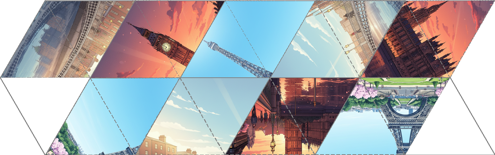

# Hexaflexagon Generator

A Python tool for generating hexaflexagon templates from images.

See the demo video: http://www.youtube.com/watch?v=alQW71N2hoM



## What is a Hexaflexagon?

A hexaflexagon is a fascinating paper folding toy that can be "flexed" to reveal different faces. It's a six-sided polygon that can be manipulated to show different images on its surface. When you flex a hexaflexagon, hidden faces are revealed while others disappear, creating an engaging interactive experience. See [Flexagon - Wikipedia](https://en.wikipedia.org/wiki/Flexagon) for more details about flexagons.

## Project Overview

This project implements in Python a hexaflexagon generator that takes three input images and creates a printable template. The generator:

- **Accepts 3 different images** as input
- **Automatically crops and scales** images to fit hexagonal segments
- **Divides each image into 6 triangular sections** arranged in a hexagonal pattern
- **Generates a printable template** with the triangles arranged according to hexaflexagon folding patterns

The resulting template can be printed, cut out, and folded to create a working hexaflexagon that displays your chosen images when flexed.

## Installation

This project uses [uv](https://docs.astral.sh/uv/) for dependency management. If you don't have uv installed, you can install it following the [official installation guide](https://docs.astral.sh/uv/getting-started/installation/).

1. Clone the repository:
```bash
git clone <repository-url>
cd hexaflexagon
```

2. Install dependencies using uv:
```bash
uv sync
```

This will create a virtual environment and install all required dependencies, including Pillow for image processing.

## Usage

### Basic Usage

To generate a hexaflexagon template, run the program with three image files:

```bash
$ uv run src/main.py <image1> <image2> <image3> [output_file] [image_size]
```

### Parameters

- `<image1> <image2> <image3>`: Paths to three image files (required)
- `[output_file]`: Output filename (optional, defaults to `output.png`)
- `[image_size]`: The size to which each image will be scaled to (optional, defaults to 500)

### Examples

```bash
# Basic usage with three images
uv run src/main.py images/paris.png images/london.png images/dublin.png

# Specify custom output file and size
uv run src/main.py face1.jpg face2.png face3.jpg my_hexaflexagon.png 300
```

### What the Program Does

1. **Loads and preprocesses images**: Each input image is cropped to a square and resized
2. **Creates hexagonal divisions**: Each image is divided into 6 triangular segments
3. **Arranges triangles**: The triangles are arranged according to the hexaflexagon template pattern
4. **Generates template**: Creates a printable template with fold lines and proper spacing

### After Generation

1. **Print** the generated template on paper
2. **Cut out** the hexaflexagon shape
3. **Fold** along the indicated lines (see folding instructions [here](folding.md))
4. **Flex** the completed hexaflexagon to reveal different image faces

## File Structure

```
hexaflexagon/
├── src/
│   ├── hexaflexagon.py    # Main HexaflexagonGenerator class
│   ├── main.py            # Command-line interface
│   └── utils.py           # Utility functions for image processing
├── images/                # Sample images
│   ├── dublin.png
│   ├── london.png
│   └── paris.png
├── pyproject.toml         # Project configuration and dependencies
├── uv.lock                # Dependency lock file
└── README.md              # This file
```

## Extending the Project

The current implementation supports 3 images, but the architecture is designed to be extensible. To support 6 different images:

1. Modify the configuration patterns in `HexaflexagonGenerator`
2. Update the triangle arrangement logic
3. Adjust the canvas size calculations

## Requirements

- Python ≥ 3.12
- Pillow ≥ 11.3.0 (automatically installed via uv)

## License

[MIT License](https://opensource.org/license/mit)
