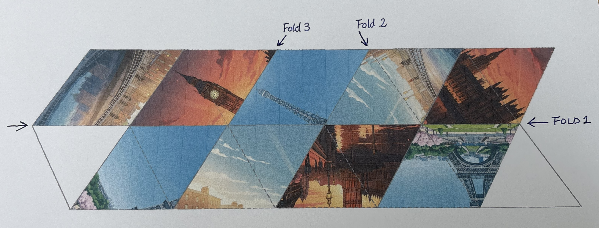
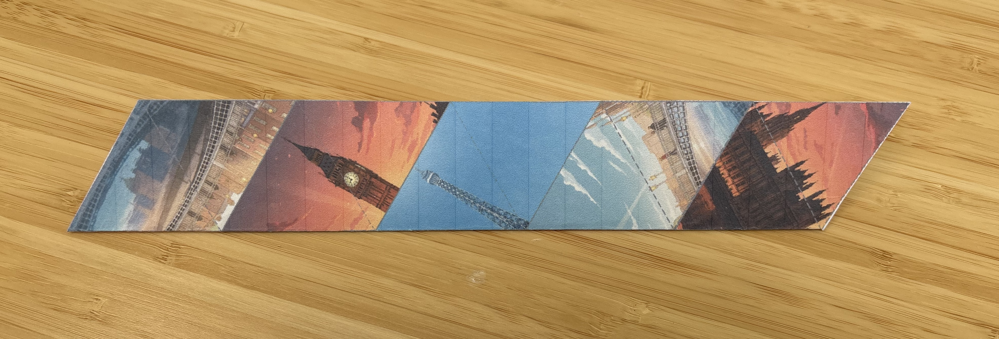
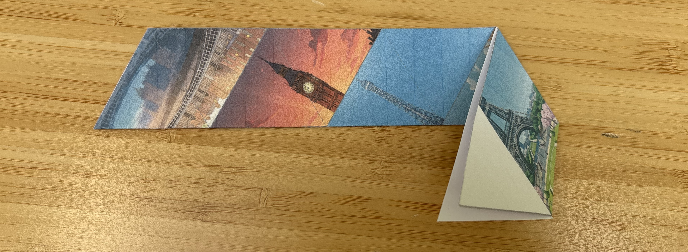
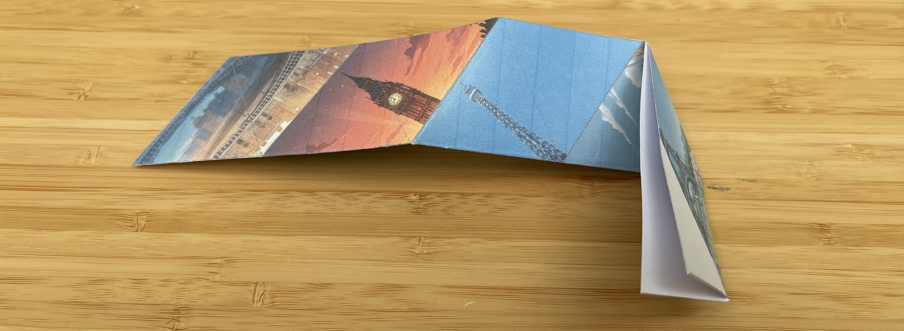
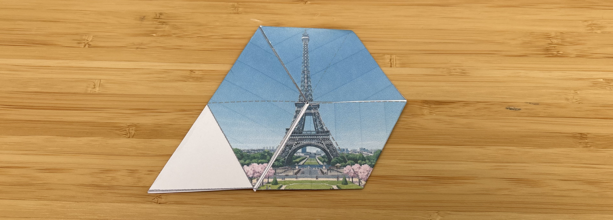
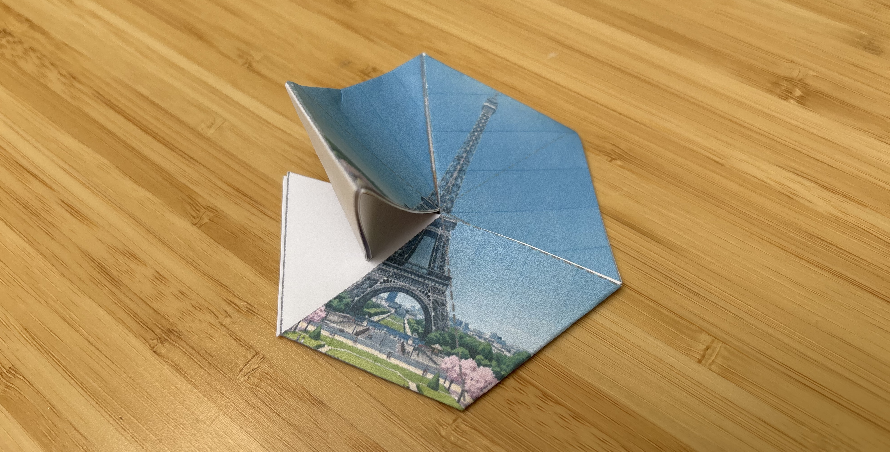

## Folding Instructions

Steps to fold the printed hexaflexagon template:

1. Cut out the hexaflexagon shape along the outer solid lines.

2. Fold along the long horizontal dashed line in the middle

3. Fold along the seconding line as indicated in the first image above

4. Fold along the third line as indicated in the first image above to the back

5. Now, you should see the Eiffel Tower image as shown below:

6. Fold the white triangle flap inward along the dashed line, and then glue it to the other white triangle underneath.

7. Finished!

Watch this video to see how you can flex through the different faces of the hexaflexagon: http://www.youtube.com/watch?v=alQW71N2hoM
